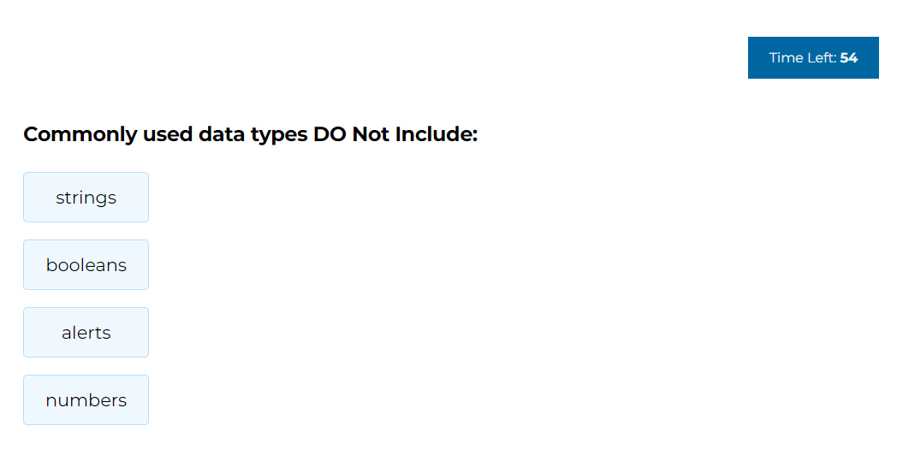

# quiz-challenge-4

## Description
This project was created to build a timed coding quiz with multiple-choice questions.
The quiz consists of a total of 5 questions, and the maximum score is 50 points.
If a wrong answer is chosen, the timer time decreases by 10 seconds.

After completing all the questions, you can save your score and initials.
Wishing you a fun quiz time!

## Live link
[**https://yiseo.github.io/quiz-challenge-4/**](https://yiseo.github.io/quiz-challenge-4/)

## Screenshot

## Installation
N/A

## Technologies Used
- HTML
- CSS
- Javascript
- Github